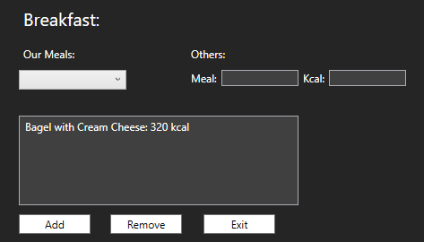
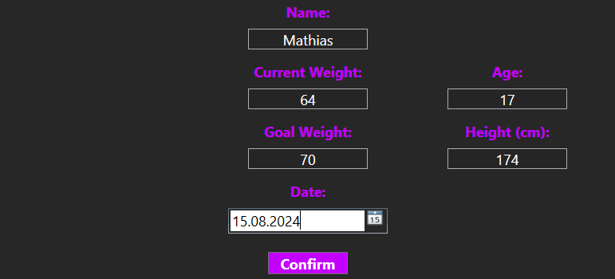

# Ernährungstracker

___ 

## Projektplanung

### Must-Haves

**Main**
- Berechnung von den Kalorien die man noch benötigt (Ziel - Nahrung + Training = Verbleibende Kalorien)
- Tracken von Wasser und Schritte 
- Die Mahlzeit zur jeweiligen Kategorie per (+) hinzufügen und dann die kcal angeben
- Wenn man auf Profil klickt öffnet sich ein neues Fenster 

**Profil**
- Aktuelles Gewicht angezeigen was man mittels - und + ändern kann daneben steht wie viel kg er noch braucht bis er sein Ziel erreicht hat
- Datum anzeige ab wann man gestartet hat
- All seine Stats also; Ziel,Nahrung,Training,Verbleibende kcal, wasser, schritte, Frühstück, Mittagsessen, Abendessen, Snacks, aktuelles Gewicht, Ziel Gewicht, (gewicht übrig wird dann neu berechnet), startdatum.

### Nice-To-Haves

- schöne Benutzeroberfläche
- Benutzerdefinierte Ziele: individuelle Ziele festzulegen, z. B. Gewichtsverlust, Muskelaufbau oder allgemeine Gesundheit.
- Ernährungstipps

### Not-To-Haves

- unnötig viele und komplexe funktionen
- Trainingsplan
- multi language

---

## Umsetzungsdetails
 
- Welche Softwarevoraussetzungen werden benötigt (mit Versionen)
  - .NET 6.0
  - Serilog (4.0)
  - Serilog.Sinks.Console (5.0.1)
  - Serilog.Sinks.File (5.0.0)

- Funktionsblöcke bzw. Architektur
  - **Benutzeroberfläche (UI)**
    - Design des Main Windows
    - First Screen (Startbildschirm)
    - Profile Window
    - Eingabefenster für Mahlzeiten (Breakfast, Lunch, Dinner, Snacks)

  - **Datenverwaltung**
    - Speicherung und Verwaltung von Benutzerdaten (Gewicht, Ziele, Mahlzeiten)
    - Berechnung von Kalorien, Wasseraufnahme und Schritten
    - Verfolgung des Fortschritts über die Zeit

  - **Logik**
    - Kalorienberechnungen
    - Gewichtsanpassungen
    - Schritte in Kilometer und Kalorien umrechnen
    - Statistiken und Fortschrittsanzeige
  
- **Detaillierte Beschreibung der Umsetzung**
    - First Screen: Der Startbildschirm, auf dem Benutzer ihr aktuelles Gewicht, Zielgewicht, ihren Namen und das Datum eingeben können, bis wann sie ihr Ziel erreichen wollen. Zudem wird eine kleine Grafik angezeigt, die das Training und die Gesamtheit der Mahlzeiten darstellt.
    - Main Window: Der Hauptbildschirm der App zeigt die tägliche Kalorienbilanz, Schritte und Wasseraufnahme. Benutzer können Schritte, Wasseraufnahme und Mahlzeiten (Frühstück, Mittagessen, Abendessen, Snacks) selbst eingeben.
    - Profile Window: Die Profilseite zeigt den Namen, das Startdatum, das Ziel- und aktuelle Gewicht sowie das Enddatum an. Es wird auch angezeigt, wie viele Kilogramm noch bis zum Ziel fehlen. Außerdem gibt es Funktionen zum Speichern und Laden des Profils sowie eine allgemeine Grafik.
    - Eingabefenster für Mahlzeiten: Fenster zur Eingabe der Kalorien für Frühstück, Mittagessen, Abendessen und Snacks. Es sind auch vorgegebene Mahlzeiten verfügbar.

- **Mögliche Probleme und ihre Lösung**
  - Langzeit-Statistiken: Da die App auf die Nutzung über mehrere Tage ausgelegt ist, könnte die Anzeige von Tagesstatistiken schwierig sein.

---

## Wie wurde die Software getestet?
 
  - Unsere App wurde durch mehrere Personen persöhnlich getestet.

---

## Bedienungsanleitung mit Screenshots

  - Der Startbildschirm begrüßt die Benutzer mit einer Einladung, die App zu starten: "Tap the screen to start." Dieser Willkommensbildschirm sorgt für eine benutzerfreundliche und interaktive Einführung. 

  - Hier geben die Benutzer ihre Informationen ein: Name, aktuelles Gewicht, Zielgewicht und das Datum, bis wann sie ihr Ziel erreichen möchten.

  - Dieses Fenster stellt das Hauptdashboard der Ernährungs- und Trainings-Tracking-App dar. Es bietet eine übersichtliche Darstellung der wichtigsten Informationen und Eingabemöglichkeiten.

  - Im oberen Bereich befindet sich die Kalorienübersicht. Hier werden die täglich angestrebte Kalorienmenge (Zielkalorien), die durch Nahrung aufgenommene Kalorienmenge (Food), die durch Training verbrannte Kalorienmenge (Training) sowie die verbleibende Kalorienmenge (Remaining) angezeigt, die der Benutzer noch aufnehmen kann, um sein Tagesziel zu erreichen.

  - Unter der Kalorienübersicht begrüßt die App den Benutzer mit einer personalisierten Nachricht: "Welcome, Mathias!", was eine persönliche Note hinzufügt und den Benutzer motiviert.
 
  - Links unten im Fenster gibt es Tracker für die Wasseraufnahme und die zurückgelegten Schritte. Die Wasseraufnahme wird in Litern angezeigt, und der Benutzer kann die Menge mithilfe der - und + Tasten anpassen. Die zurückgelegte Strecke wird in Kilometern angezeigt, basierend auf den Schritten, die der Benutzer gemacht hat. Auch hier kann die Menge mit den - und + Tasten angepasst werden.
 
  - Rechts daneben befinden sich die Eingabefelder für die Mahlzeiten. Der Benutzer kann die Kalorienmenge für Frühstück, Mittagessen, Abendessen und Snacks eingeben und anpassen. Neben jeder Mahlzeit wird die Kalorienmenge angezeigt, und durch Klicken auf das + Symbol können weitere Kalorien hinzugefügt werden.
 
  - Ganz rechts im Fenster gibt es eine Grafik, die den Vergleich zwischen der aufgenommenen Nahrung und dem durch Training verbrannten Kalorien visuell darstellt. Diese Grafik hilft dem Benutzer, einen schnellen Überblick über seine tägliche Kalorienbilanz zu bekommen.
 
  - Oben rechts im Fenster befindet sich ein Button, der zum Profil des Benutzers führt. Hier kann der Benutzer weitere persönliche Informationen und Statistiken einsehen und anpassen.

 
  - Im Profilbereich hast du die Möglichkeit, dein aktuelles Gewicht anzupassen. Dort werden dir dein Startgewicht, dein aktuelles Gewicht und dein Zielgewicht angezeigt, sowie die noch erforderlichen Kilogramm, um dein Ziel zu erreichen. Zusätzlich kannst du deine Statistiken und den Fortschritt nach Land speichern. Eine Grafik bietet einen umfassenden Überblick über das gesamte Programm im zeitlichen Verlauf.

---

# Aufgabentabelle: Mathias Florea

|       | Design                                     | FirstScreen                                            | MainWindow                                                                                                                                                  | Breakfast                                                                                                                                                                      | Lunch                                                                                                                                                                                   | Dinner          | Snacks          | Profile                                                                                                                                         | Sonstiges                                                                                                                                                                                                                                                                         |
| ----- | ------------------------------------------ | ------------------------------------------------------ | ----------------------------------------------------------------------------------------------------------------------------------------------------------- | ------------------------------------------------------------------------------------------------------------------------------------------------------------------------------ | --------------------------------------------------------------------------------------------------------------------------------------------------------------------------------------- | --------------- | --------------- | ----------------------------------------------------------------------------------------------------------------------------------------------- | --------------------------------------------------------------------------------------------------------------------------------------------------------------------------------------------------------------------------------------------------------------------------------- |
| 08.05 | ganzes Design für den MainWindow           |                                                        |                                                                                                                                                             |                                                                                                                                                                                |                                                                                                                                                                                         |                 |                 |                                                                                                                                                 |                                                                                                                                                                                                                                                                                   |
| 11.05 | Design von Breaktfas Menü und first window | Hinzufügen von currentWeight und goalWeight sowie Name | Wasser,Steps hinzufügen, öffnen von Breakfast Menü, Berechnung von kg in kcal bzw. wird das dann auch angezeigt (food und training funktioniert noch nicht) | eingabe von eigenen Meals und vorgeschlagene Meals                                                                                                                             |                                                                                                                                                                                         |                 |                 |                                                                                                                                                 |                                                                                                                                                                                                                                                                                   |
| 15.05 |                                            |                                                        |                                                                                                                                                             |                                                                                                                                                                                | bug gefixt, einträge von Breakfast werden nun in das Mainwindow gespeichert(kcal), einträge werden nun in der listbox von breakfast gespeichert auch wenn man raus und wieder reingeht, |                 |                 |                                                                                                                                                 | Klasse erstellet für Breakfast, Lunch, Dinner und Sancks, demenstprechend auch die ausgebaut. Gesicherte eingaben nochmal überarbeitet, "Tap to start" screen und das es nur 1x vorkommt, bug gefixt das wenn man aus profile rausgeht nicht wieder in den firstscreen reinkommt. |
| 22.05 |                                            |                                                        |                                                                                                                                                             |                                                                                                                                                                                |                                                                                                                                                                                         |                 |                 | aktuelle und zielgewicht sowie name werden vom firstscreen übernommen, kg remaining werden berechnet, eingabe von kg um remaining zu reduzieren |                                                                                                                                                                                                                                                                                   |
| 05.06 |                                            |                                                        |                                                                                                                                                             | Korrekte berechnung von den schritten(km) in kcal, training wird richtig angezeigt, sowie wird in der oberen leiste die kcal aller Mahlzeiten zusammengerechnet und angezeigt. |                                                                                                                                                                                         |                 |                 |                                                                                                                                                 |                                                                                                                                                                                                                                                                                   |
| 08.06 | Firstscreen, Profile Menü                  |                                                        | funktionalität von Lunch, Dinner, Snacks                                                                                                                    | mehr mahlzeiten                                                                                                                                                                | mehr mahlzeiten                                                                                                                                                                         | mehr mahlzeiten | mehr mahlzeiten | Datum angepasst (Startdatum - Zieldatum)                                                                                                        |
| 09.06 |                                            |                                                        | Kleine Grafik als übersicht auf Mahlzeiten und Training, mainwindow kilomenterstand reduzieren bug gefixt, remove meal from listbox gefixt                  |                                                                                                                                                                                |                                                                                                                                                                                         |                 |                 |                                                                                                                                                 | Logging, buttons schöner gemacht                                                                                                                                                                                                                                                  |

--- 

# Aufgabe: Lev Pop

Alle Klassen gemacht, die Klasse StepsCounter, WaterCounter und UnserProfile. Die Serializierung und Deseralisierung habe ich ebenso gemacht. Das Save und Load button im Profil ebenso. Im Profil habe ich die Statistik gezeichnet.